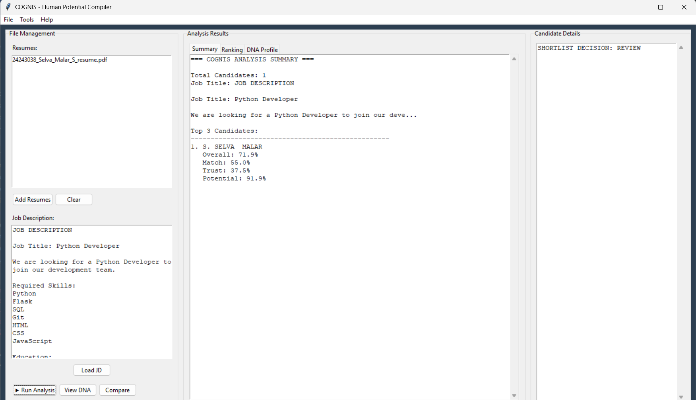
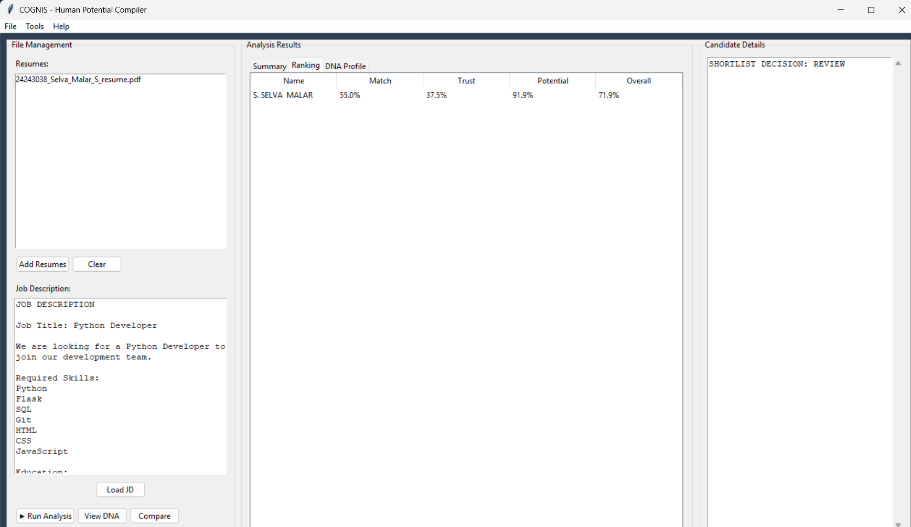

# 🚀 COGNIS
### Intelligent Resume Analyzer & Hiring Intelligence Platform

> Transforming Resume Screening into Data-Driven Hiring Decisions

---

## 📌 Overview

COGNIS is an intelligent resume analysis system designed to automate candidate evaluation by comparing resumes against a Job Description (JD).

The platform helps recruiters identify the most suitable candidates through skill matching, trust analysis, growth potential assessment, ranking, and shortlist recommendations.

---

## 🎯 Problem Solved

Traditional resume screening is:

- Time-consuming
- Manual and repetitive
- Prone to human bias
- Difficult to scale

COGNIS reduces recruiter effort by automatically analyzing and ranking candidates based on multiple evaluation parameters.

---

## ⚡ Core Features

### 📄 Resume Intelligence
✔ Resume Parsing  
✔ Skills Extraction  
✔ Experience Analysis  
✔ Education Analysis  
✔ Certifications Detection  
✔ Achievements Detection  

### 🎯 JD Matching Engine
✔ Job Description Parsing  
✔ Skill Matching  
✔ Missing Skill Detection  
✔ Match Score Calculation  

### 🧠 Advanced Evaluation
✔ Trust Score  
✔ Potential Score  
✔ Consistency Analysis  
✔ Future Growth Prediction  
✔ Overall Candidate Score  

### 🏆 Hiring Decision Support
✔ Candidate Ranking  
✔ Shortlist Recommendation  
✔ Talent DNA Analysis  
✔ Career Path Recommendation  
✔ Alternative Career Suggestions  

### 📊 Reporting
✔ Candidate Reports  
✔ DNA Visualization  
✔ Analysis Summary  

---

## 🏗 System Workflow

```text
Job Description
        │
        ▼
 Resume Upload
        │
        ▼
 Resume Parsing
        │
        ▼
 Skill Extraction
        │
        ▼
 Multi-Factor Evaluation
        │
        ▼
 Ranking Engine
        │
        ▼
 Shortlist Decision
```

---

## 📈 Scoring Model

```text
Overall Score =
25% Match Score
20% Trust Score
25% Potential Score
15% Consistency Score
15% Future Growth Score
```

---

## 🏅 Shortlist Logic

```text
Overall ≥ 70  AND Match ≥ 60
        ↓
    SHORTLISTED

Overall ≥ 55
        ↓
      REVIEW

Else
        ↓
 NOT RECOMMENDED
```

---

## 🛠 Technology Stack

- Python
- Tkinter
- JSON
- Regular Expressions
- File Handling
- Object Oriented Programming

---

## 📂 Project Structure

```text
COGNIS
│
├── main.py
├── gui.py
├── resume_analyzer.py
├── jd_matcher.py
├── trust_score.py
├── potential_score.py
├── consistency_engine.py
├── ranking_engine.py
├── future_simulator.py
├── dna_visualizer.py
├── report_generator.py
└── results/
```

---

## ▶ Running the Application

```bash
python main.py
```

---

## 🌟 Future Enhancements

- Batch Resume Screening
- CSV Export
- Explainable AI Scoring
- Skill Gap Roadmaps
- Dashboard Analytics
- Cloud Deployment

---

## Application Screenshots

### Analysis Summary


### Candidate Ranking


### Candidate Details


## 👨‍💻 Developed By

**Selva Malar**  
B.Tech Artificial Intelligence & Data Science  
National Engineering College, Kovilpatti

---

### "Hiring Beyond Resumes. Discovering Potential."
